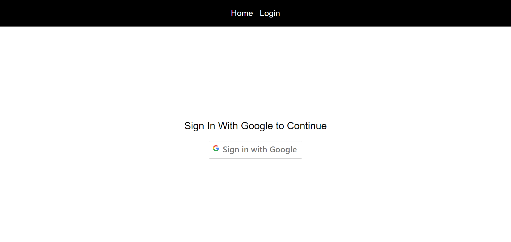
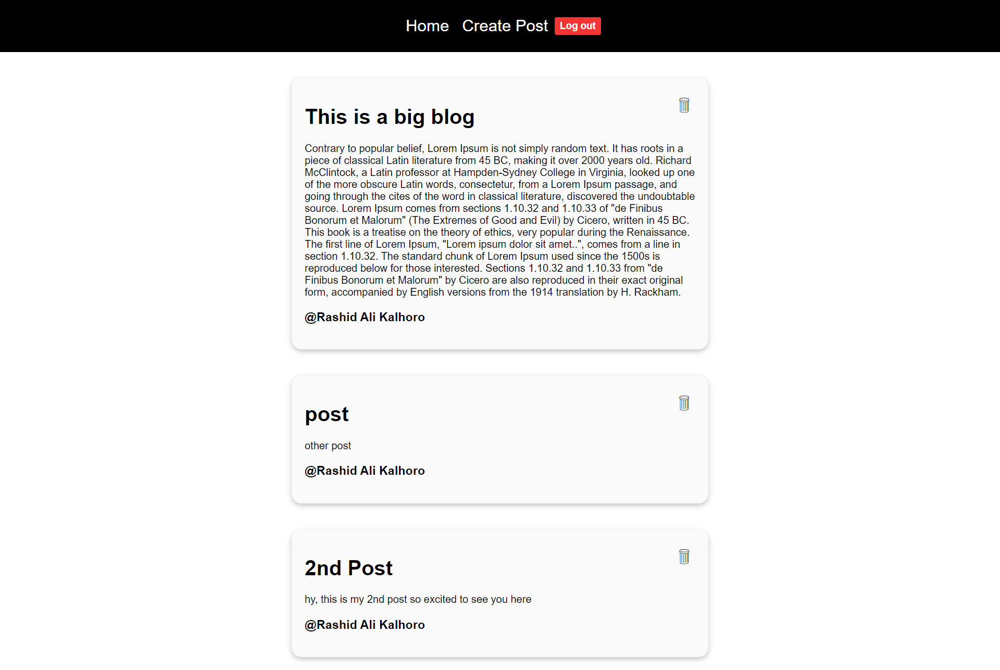

# :closed_book: Blogs Website

### _React Blog Website | Firebase !!_

### Link :link: https://rak-blogs-site.netlify.app/

## Interface

## Run Locally

  - Run This command `https://github.com/developer-rak/blog_website.git`
  - You are now in the dev environment and you can play around

## ✨ Features

  - Home
  - Login
  - Create Post
  - Delete Post
  - LogOut
  - Open Source (Tweak it and use it)

## ⚙️ Tech Stack
  - HTML5
  - CSS3
  - React
  - Firebase
  - Netlify
